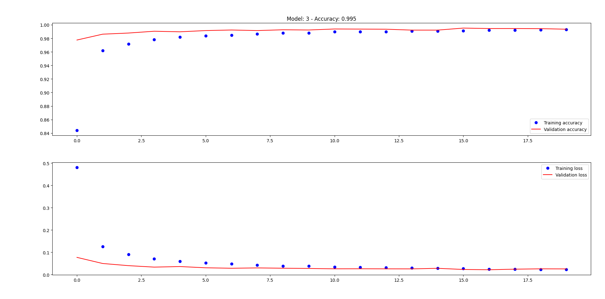
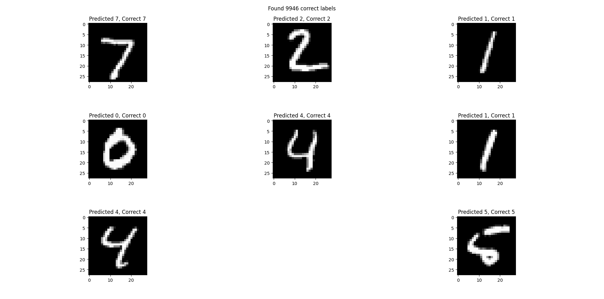
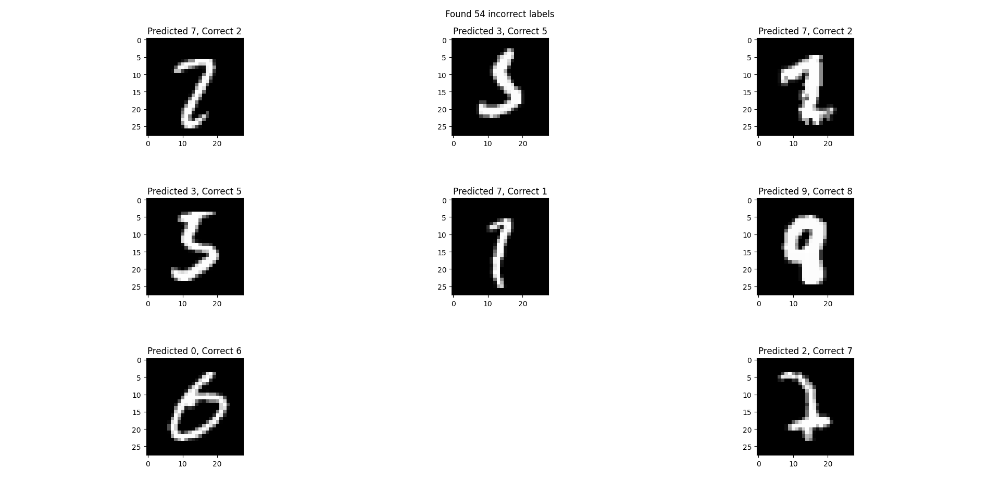
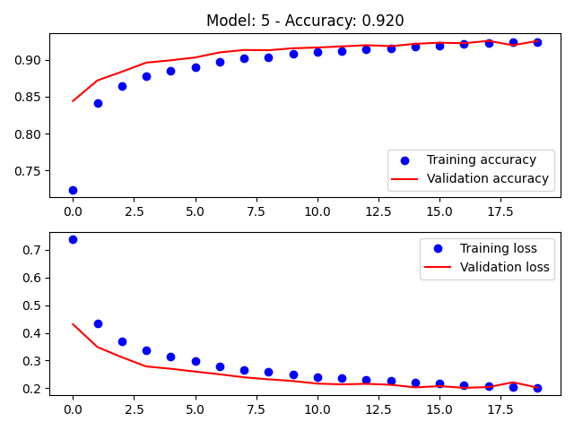
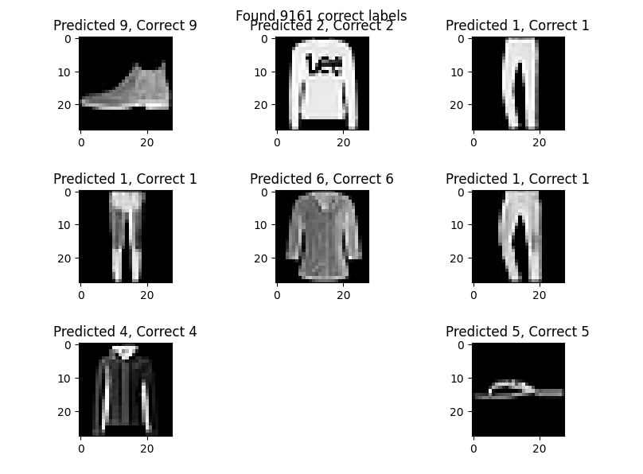
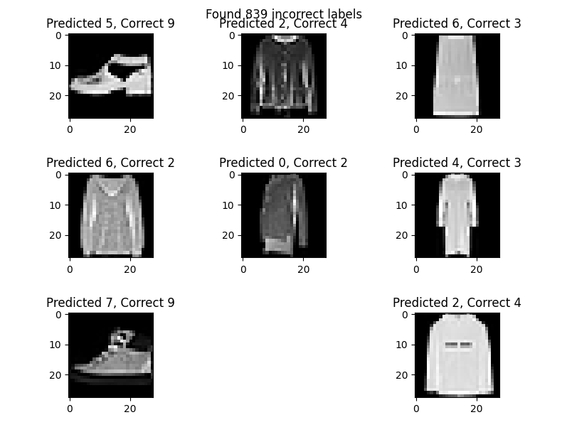

# Work Report
Objective of the work is test 5 setups for the CNNs with focus in the accuracy improve values
(during training and test phases) for 20 (or more) learning epochs. At the end of the analysis it is necessary to define the best model, in terms of performance metrics (accuracy or MSE, Mean Squared Error) to the evaluated CNNs the the MNIST and MNIST-like fashion product database.

## Models
 - Model 1: LeNet
 - Model 2: AlexNet
 - Model 3: VGGNet
 - Model 4: Generic Setup
 - Model 5: Generic Setup

## How to run? 
```
usage: run.py [-h] [--train | --no-train] N

Convolutional neural networks (CNNs)

positional arguments:
  N                     Model number

optional arguments:
  -h, --help            show this help message and exit
  --train, --no-train   train model (default: False)
```

## MNIST Number

The MNIST database (Modified National Institute of Standards and Technology database) is a large database of handwritten digits that is commonly used for training various image processing systems.The database is also widely used for training and testing in the field of machine learning. It was created by "re-mixing" the samples from NIST's original datasets. The creators felt that since NIST's training dataset was taken from American Census Bureau employees, while the testing dataset was taken from American high school students, it was not well-suited for machine learning experiments. Furthermore, the black and white images from NIST were normalized to fit into a 28x28 pixel bounding box and anti-aliased, which introduced grayscale levels.

The model with most accuracy is Model 3 with 9946 correct labels and 54 incorrect labels.



This graph demonstrates the model's learning process over time, symbolized by learning epochs. The synchronization between the training and validation lines, even though the validation loss and the precision line are not linear, demonstrates that the model is not overfitting (validation loss is decreasing and not increasing, and there is not much gap between the training and validation accuracy).





## MNIST Fashion

Fashion-MNIST is a dataset of Zalando's article images—consisting of a training set of 60,000 examples and a test set of 10,000 examples. Each example is a 28x28 grayscale image, associated with a label from 10 classes. Zalando intends Fashion-MNIST to serve as a direct drop-in replacement for the original MNIST dataset for benchmarking machine learning algorithms. It shares the same image size and structure of training and testing splits.


### Enumerator

0. T-shirt/top
1. Trouser
2. Pullover
3. Dress
4. Coat
5. Sandal
6. Shirt
7. Sneaker
8. Bag
9. Ankle boot


The model with most accuracy is Model 5 with 9161 correct labels and 839 incorrect labels.






